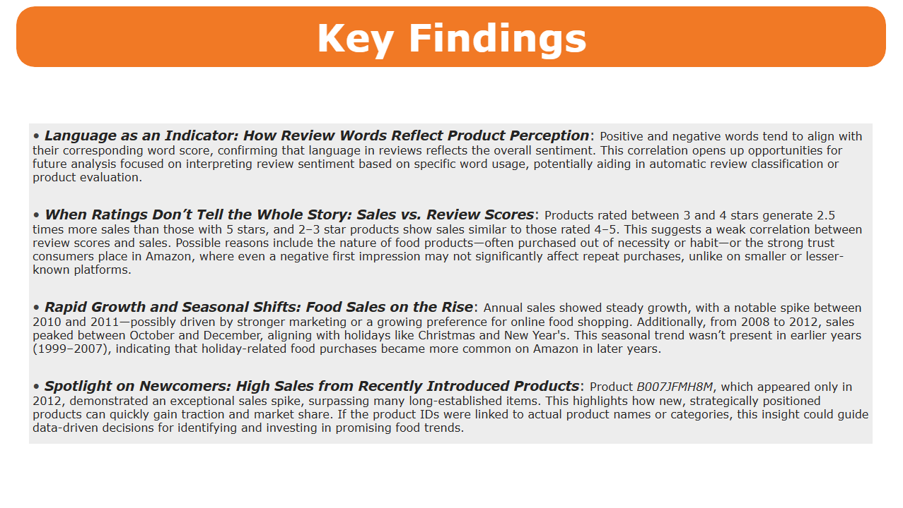

# Amazon Food Reviews Analysis

## *Introduction*
This projects an exploratory analysis of Amazon food products reviews using **Python** and **Power Bi**. The main goal here is to uncover insights about costumer sentiment, sales trend, and user behavior. All of this based on thousands of real-world product reviews (1999-2012).

The dataset covered here is from Kaggle and you can download it and analyse it yourself here: https://www.kaggle.com/datasets/snap/amazon-fine-food-reviews

##  *Dataset Summary*
This dataset contains thousands of rows, each representing a customer review with variables such as score, review text, user ID, product ID, timestamp, helpfulness ratings, and more. Below is a list of all available columns:

| Column Name             | Description                                                                 |
|-------------------------|-----------------------------------------------------------------------------|
| Id                      | Row Id                                                                      |
| ProductId               | Unique identifier for the product                                           |
| UserId                  | Unique identifier for the user                                              |
| ProfileName             | Profile name of the user                                                    |
| HelpfulnessNumerator    | Number of users who found the review helpful                                |
| HelpfulnessDenominator  | Number of users who indicated whether they found the review helpful or not  |
| Score                   | Rating between 1 and 5                                                      |
| Time                    | Timestamp for the review                                                    |
| Summary                 | Brief summary of the review                                                 |
| Text                    | Text of the review                                                          |

As you can see, the dataset contains valuable information that can lead us to several interesting questions, such as:

- What is the all-time average score?

- Which words in the review text are most associated with high or low scores?

- How has the frequency of reviews changed over the years?

- Which product IDs have the highest average ratings?

In this analysis, we’ll explore patterns and insights based on key questions.

## *Data Preparation & Tools*
As mentioned earlier, the two main tools used throughout this project are Python and Power BI—both essential in the toolkit of any data analyst. While Power BI is fully capable of handling data preparation tasks, I chose to use Python for the data cleaning and modeling stages, as I find myself more proficient and flexible with it for these purposes.

Another key tool in this process was JupyterLab, which allowed me to write and execute code in well-organized blocks, making the workflow clearer and more efficient. You can view all the .ipynb notebooks used in this analysis in the [scripts](./scripts/) folder.


### Preparation 1: Python

In the [scripts](./scripts/) folder, you can check all the processing script in the [data_processing.ipynb](./scripts/data_processing.ipynb) file.

To begin the data preparation process, i downloaded the .csv file from the kaggle link mentioned before and imported using "read_csv()" function.
```python
import pandas as pd
data = read_csv(path)
print(data)
```
Although I could have imported the dataset using other methods—such as the Kaggle API—I chose a simpler approach for this case by manually downloading the file. The data is now loaded and accessible through the data variable, ready for transformation and analysis.

One important preprocessing step was removing rows with NULL values in essential columns to ensure the integrity of each record. Additional cleaning operations included validating the Score column to remove values outside the 0–5 range, and checking for inconsistencies in the HelpfulnessNumerator and HelpfulnessDenominator fields.

```python
t_data = data.copy()
# Removing Null Rows
t_data = t_data.dropna(subset=['ProductId', 'UserId', 'Time', 'Text'])

# Removing Invalid Scores
t_data = t_data[(t_data['Score'] >= 0) & (t_data['Score'] <= 5)]

# Removing invalid helpfulness
t_data = t_data[t_data['HelpfulnessNumerator'] <= t_data['HelpfulnessDenominator']]
```

If you examine the columns in the dataset, you'll notice that it includes a HelpfulnessNumerator, which indicates the number of users who found a review helpful. However, it doesn't explicitly show how many users did not find the review helpful.

To address this and make the data easier to analyze, I created a new column that calculates the difference between HelpfulnessDenominator and HelpfulnessNumerator. This new column directly represents the number of users who did not find the review helpful, providing a clearer and more interpretable metric for our analysis:

```python
negativeHelpfulness = data['HelpfulnessDenominator'] - data['HelpfulnessNumerator']
pos = data.columns.get_loc('HelpfulnessNumerator')
t_data.insert(pos+1, 'NegativeHelpfulness', negativeHelpfulness)
t_data = t_data.rename(columns={'HelpfulnessNumerator': 'PositiveHelpfulness'})
t_data = t_data.rename(columns={'HelpfulnessDenominator': 'TotalHelpfulness'})
```

Now we have two clearer columns: PositiveHelpfulness and NegativeHelpfulness, which make the data much easier to interpret.

Regarding the time aspect, the Time column in the original dataset was not in a proper datetime format—it was stored as an object type. To resolve this, I converted the column to a valid datetime format using the appropriate transformation:

```python
t_data['Time'] = pd.to_datetime(t_data['Time'], unit='s', utc=True)
```
Now all the date values are available for search and operations.

Finally, the dataset can be saved in a .csv format:
```python
t_data.to_csv('dataset/Reviews_t.csv')
```

As you can see in the scripts folder, there are four additional notebooks. Each of them was created to transform the data into specific tables tailored for easier use and analysis in Power BI.

### Preparation 2: Power Bi

Power BI is responsible for the visualizations and overall presentation of the analysis. Each of the four key insights is showcased on its own slide, using visuals built from the tables created in the Python notebooks.

As mentioned earlier, it would have been possible to complete the entire data preparation process using only Power BI and its built-in tools. However, in this case, I chose to handle all data processing in Python and use Power BI exclusively for visualization purposes.

## *Data Analysis, key questions*

With the data cleaned and prepared, I explored the dataset and formulated a set of questions aimed at uncovering valuable insights. It's important to note that my perspective is external, without deep contextual knowledge of Amazon's internal operations or goals. If I had a closer connection to the business context, the questions might have been different or more targeted.

That said, the goal here was to uncover patterns, spark curiosity, and identify interesting stories hidden within the data—treating the process like solving small mysteries through analysis.

---

### First Analysis (creating):
- "What words have good impact in reviews and what words have bad impact in reviews. Those words indicate something about the overall products?"

This type of question leads us to a "sentiment" analysis. Sentiment analysis measure how words is relationated with scores, and that scores meaning "good" to "bad".

To achieve this, I created a manual script that counts unique words in positive and negative reviews separately. Each word is then assigned a ratio based on its frequency in positive versus negative reviews. A ratio of 1 or higher indicates a tendency toward positive sentiment, while a ratio below 1 suggests a negative sentiment.

It's important to note that common stop words and misspelled words are excluded from the analysis. This ensures the focus remains on words that carry real analytical value.


Bellow you can see the code part that shows the "stop_words" and "english_words" filter:
```python
stop_words = set(stopwords.words('english')) # Preset to remove "stop words" like "before, and, i, again"
english_words = set(words_nltk.words()) # Preset to remove words that are not present in the english language
translator = str.maketrans('', '', string.punctuation) # Preset to remove punctuation

for index, row in data.iterrows():
    ...
    mask = np.vectorize(lambda w: w.lower() not in stop_words)(words)
    words = words[mask]

    mask = np.vectorize(lambda w: w.lower() in english_words)(words)
    words = words[mask]
    ...
```

The rest of the code is available in the [1_sentiment.ipynb](./scripts/1_sentiment.ipynb) notebook.

The final result is saved as a new CSV file, highlighting the "impact" of each word based on the WordRatio column.

See the example below:


At the end of this process, we can import the csv data into Power Bi and look at the results with two different bar charts, one for positive words, and other for negative words.


The graph on the left displays the top words with the highest WordRatio values, while the graph on the right shows those with the lowest.

- "Why you not used a word-cloud visualization?"

I could have used other visualizations, but I preferred something that presents the values in a more technical and ordered way, either ascending or descending. In some cases, word clouds or even bar charts can be misleading, depending on how the data is interpreted.

### First Analysis (insight):

With the final visualization in hands, we can now answer some questions!
- "What words have the most positive or negative impact in reviews?"

By looking at both graphs, we can see that some words are mostly easy to recognise as good or bad words, indicating that the algorithm went the right way.

Some positive words like "Good, Great, Like" appears the most in positive reviews, while "Unmeasured, Buffoon, Uncaring, Returnable, Grotesque, Miserly" appear the most in negative reviews.

- "These words indicate something specific information about some products?"

We can assume that both positive and negative reviews are generally not focused on specific topics, but rather express a simple judgment—whether the food is good or bad.

So why analyze the connotation of words? This approach helps us identify whether a review leans positive or negative based solely on its text. For instance, a review rated 3 stars or higher might still contain negative remarks. By measuring word sentiment, we can more accurately assess the tone of reviews and take a closer look at specific products that may have mixed feedback.

Finally, we were able to confirm that positive words predominantly appeared in positive reviews—and similarly, negative words were mostly found in negative reviews.

---

### Second Analysis (creating)

The second question is very interesting:
- "Do reviews have a direct impact on the average number of food product purchases per user?"

Our goal here is to create a table that takes the number of products purchased by each user and make a mean of these numbers based in a certain score range. These ranges will start in 0 and go to 5, in a scale of 1 by 1.

Look at the example bellow:


Here you see that we made a "groupby" in all user purchases based in a scale and used ".mean()" to group these values.

```python
labels = ['0-1', '1-2', '2-3', '3-4', '4-5']
bins = [0, 1, 2, 3, 4, 5]

df_v1 = df.groupby('UserId')['Score'].agg(['mean', 'count']).reset_index()

df_v1['ScoreRange'] = pd.cut(df_v1['mean'], bins=bins, labels=labels, include_lowest=True, right=True)
df_v2 = df_v1.groupby('ScoreRange')['count'].mean().reset_index().rename(columns={'count':'AveragePurchases'})
df_v2['AveragePurchases'] = df_v2['AveragePurchases'].round(2)

df_v2
```

With the final table in hands, we can export to csv and import to Power Bi.

### Second Analysis (insight)

Now that we have a table showing the average purchase made by user based on score ranges, let's make this more intuitive, creating in power bi a column chart and a pie chart.

The column chart will show to us, in y-axis, the average purchase, while in x-axis, the label of the ranges itself.

The pie chart will take what we consider "good scores" (3 to 5) and compare the average purchase to what we consider "negative scores" (0 to 2).


With these two graphs, we can easily see some very good informations.

- "The score of the users diretcly impact the average purchase?"

Yes, it shows that good scores tend to have an average of purchases bigger than low scores. But a very weird thing is, the difference is not that high and, in other cases, the difference almost no exist.

Interestingly, the average number of purchases for ratings between 3 and 4 is higher than for those between 4 and 5. Additionally, the average for ratings between 2 and 3 is very close to that of the 4–5 range. While products rated below 2 show a lower purchase rate, the difference isn’t particularly significant. What might this indicate?

Considering we are analyzing food reviews—products that fulfill both basic human needs and personal preferences, this suggests that people continue to purchase food regardless of how satisfied they were, whether out of necessity or habit.

Another factor is that Amazon has never been primarily known for food sales. It's more strongly associated with electronics, books, and general merchandise.

Lastly, as a well-established and trusted platform, Amazon often encourages repeat purchases, even when the initial experience wasn't ideal. This differs from smaller or lesser-known websites, where poor experiences may deter users from returning due to a lack of brand credibility.

---

### Third Analysis (creating)

The third question that we can make is very important for any market business:

- "The products sales increased each year since 1999? There was some step down? There was a huge peak in some year?"

All these questions can be answered by creating script that group all the sales by year and month from 1999 to 2012.

using python, we can groupby the "Time" column by year, month and see the number of diferent sales in each of these groups.

```python
ym_sales = df.groupby([df['Time'].dt.year.rename('Year'), df['Time'].dt.month.rename('Month')]).size().to_frame('Sales')
```

With a single line command, we can create three column, "Year", "Month", and "Sales". It will look like this:


As you can see, the data in the entire table is suficient to answer our questions in Power Bi.

### Third Analysis (insight)

Importing the data to Power Bi, we can create two simple column charts, one that shows the sales per year, and one that shows the sales por month (looking for trends).


We can easily see that the sales only go up, with a more significant increase between 2005 and 2012. The graph has a exponential growth, with some points more inclined than others. The most notable growth is between 2010 and 2011, were the sales doubled in a single year, increasing more in the year of 2012.

This indicates that the approach used by amazon in these years worked very well, impacting the consumer and influencing more users to purchase food related products in those years.

Looking at the montly sales pattern, we can se that the sales pattern between 1999 and 2012 are a little random, but looks like we have three main peaks, in Jan, Mar and Sep.

Looking at the sales per month in 2011 could bring us a more impactfull insight:


Here, we observe a more familiar sales trend, with higher sales occurring between September and December, peaking in December, likely due to Christmas and New Year's celebrations, which makes sense.

When looking at monthly sales across all years, the seemingly "random" pattern might be explained by the fact that we are analyzing food products, which are generally less influenced by festive events compared to other categories.

In summary, there was strong overall product growth, with a particularly significant impact in the year 2011.

---

### Fourth Analysis (creating)

The fourth question focuses on the sales of specific products:
- "Which products had the highest sales each year?"

To answer this, we can use a groupby on the product ID and analyze its frequency for each year.

One important limitation is that I only have access to the product IDs, not the actual product names. This means I can't draw conclusions based on the type of food or any social trends influencing demand for specific products in certain years. However, this limitation could be resolved if someone has access to a database that links product IDs to product names.

With that in mind, the code to generate the desired table is quite straightforward:

```python
dft['Time'] = pd.to_datetime(dft['Time'])
dft['Year'] = dft['Time'].dt.year

product_sales = dft.groupby(['Year','ProductId']).size().reset_index(name='Sales_Count')

product_sales = product_sales.sort_values(['Year', 'Sales_Count'], ascending=[True, False]).groupby('Year').head(10).reset_index(drop=True)
product_sales
```

Grouping the values by year and productId, we can measure the top 10 products in each year, forming the table in bellow:


So, we have 126 products in the top 10 of some year between 1999 and 2012.

### Fourth Analysis (insight)

Importing the data to power bi, we can make a bar graph aligning with a year filter. This can make we look at the top sales in each year easily and correlate the top products between certain years.


As an example, I created a filter to display the top 10 products for 2011 and 2012. The result highlights a food product (ID: B007JFMH8H) that experienced a significant spike in sales growth.

Although I can't extract further insights directly from the product ID alone, this table could be integrated into a relational database that maps product IDs to their corresponding names. With that connection, it would be possible to identify specific food trends by year and support data-driven decision-making.

## *Conclusions / Key Findings*

After reviewing all the analyses and visualizations, several key insights emerge. In summary, the most valuable takeaways are:



You can see the key findings in text, bellow:

**Language as an Indicator: How Review Words Reflect Product Perception**: 

Positive and negative words tend to align with their corresponding word score, confirming that language in reviews reflects the overall sentiment. This correlation opens up opportunities for future analysis focused on interpreting review sentiment based on specific word usage, potentially aiding in automatic review classification or product evaluation.

**When Ratings Don’t Tell the Whole Story: Sales vs. Review Scores**: 

Products rated between 3 and 4 stars generate 2.5 times more sales than those with 5 stars, and 2–3 star products show sales similar to those rated 4–5. This suggests a weak correlation between review scores and sales. Possible reasons include the nature of food products—often purchased out of necessity or habit—or the strong trust consumers place in Amazon, where even a negative first impression may not significantly affect repeat purchases, unlike on smaller or lesser-known platforms.

**Rapid Growth and Seasonal Shifts: Food Sales on the Rise**: 

Annual sales showed steady growth, with a notable spike between 2010 and 2011—possibly driven by stronger marketing or a growing preference for online food shopping. Additionally, from 2008 to 2012, sales peaked between October and December, aligning with holidays like Christmas and New Year's. This seasonal trend wasn’t present in earlier years (1999–2007), indicating that holiday-related food purchases became more common on Amazon in later years.

**Spotlight on Newcomers: High Sales from Recently Introduced Products**: 

Product B007JFMH8M, which appeared only in 2012, demonstrated an exceptional sales spike, surpassing many long-established items. This highlights how new, strategically positioned products can quickly gain traction and market share. If the product IDs were linked to actual product names or categories, this insight could guide data-driven decisions for identifying and investing in promising food trends.

## End

This concludes my project. I'm excite to explore more datasets and amplify my knowledge and critical view on future Data Analysis project!
